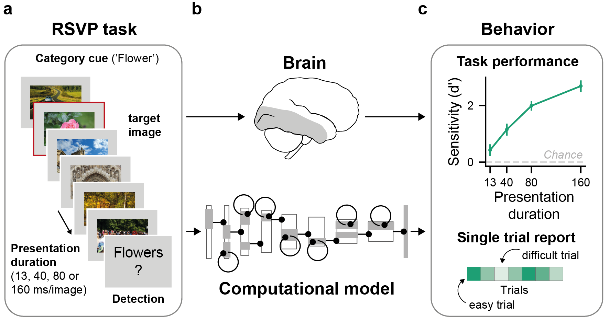

# Mechanisms of human dynamic object recognition revealed by sequential deep neural networks
by Lynn K.A. Sörensen, Sander M. Bohté, Dorina de Jong, Heleen A. Slagter, & H. Steven Scholte

*Last updated: September 30th, 2022*

This figure is part of this [preprint](https://www.biorxiv.org/content/10.1101/2022.04.06.487259v2).

### Overview
This is the code to reproduce the results of this [paper](https://www.biorxiv.org/content/10.1101/2022.04.06.487259v2). All paper figures and analyses can be reproduced using `main.py`.
The same script also contains example on how to run the models on specific trials (i.e., `showExampleImageTraces`). For testing the models on new data, it is recommended to imitate the functions in `trials.py`.  

### Dependencies
For all software dependencies, please refer to `requirements.txt`. 

All model implementations rely on the [rcnn_sat](https://github.com/cjspoerer/rcnn-sat) repository. Make sure to clone it to a folder in `resources/rcnn_sat`. 
The weights for the pretrained models can be accessed [here](https://osf.io/mz9hw/).
For testing the models on object classification, you can download ecoset [here](https://codeocean.com/capsule/9570390/tree/v1) .

All experimental behavioural data can be downloaded [here](https://osf.io/c9gs8/) and should be placed in a directory `resources/humanBehaviour`.
All analyses result files can be downloaded [here](https://osf.io/c9gs8/). Please make sure to add the files to folder `BLnext/results` to reproduce the Figures using `__main__.py`.

